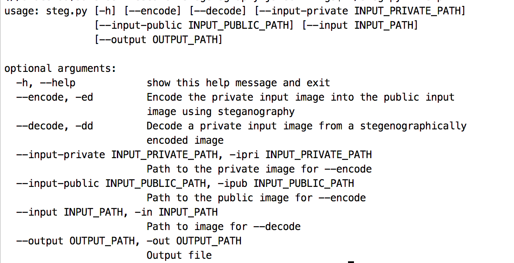

# research-steganography
Steganography is the process of hiding data in plain sight. For instance, messages can be hidden in the least significant bits of images. That's what this utility does. It allows arbitrary data to be encoded into the least significant bits of images.
 

This is a work in progress repository, so it is lacking in automated testing right now. Feel free to submit a PR. Otherwise, I'll get to it eventually.

### Installing ###
To install `steg.py` as a utility, follow these steps. 
1. Move into the directory in which you wish to install the utility. This isn't super important. It'll work anywhere. Run `cd /opt/util` or something
1. Run `git clone https://github.com/jake-billings/research-steganography`
1. Move into the cloned repository. `cd research-steganography`
1. Try before you buy. Run `python steg.py`. Maybe try doing some steganography.
1. Give the installer permission to run `chmod +x install.sh`
1. Install the command by creating a symlink. Run `./install.sh`

The script `install.sh` also runs `chmod +x steg.py` to give steg.py execution permission. If the script does not run properly, you may have to run this manually.

### Other Projects ###
Checkout my other projects at [http://www.jakebillings.com](http://www.jakebillings.com) or contact me via [LinkedIn](https://www.linkedin.com/in/jake-billings/).